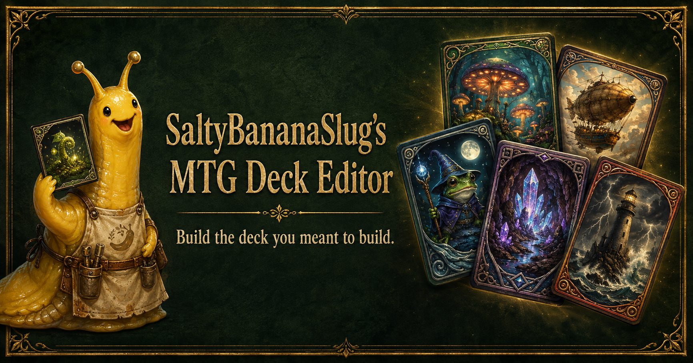

# SaltyBananaSlug's MTG Deck Editor



A downloadable Commander deck workshop for importing a deck, checking its actual 100 cards, evaluating additions, comparing replacements, and exporting an exact-print list back to Archidekt or Moxfield.

[Download the latest Windows build](https://github.com/M0tleyDrew/MagicTheGathering/releases/latest/download/SaltyBananaSlugs-MTG-Deck-Editor-Windows-x64.zip) · [Try the browser build](https://saltybananaslug-mtg-deck-editor.saltybananaslug.chatgpt.site)

## What it does

- Imports public Archidekt links, best-effort public Moxfield links, Moxfield export text, and ordinary decklist text.
- Counts only the commander zone and main deck toward the Commander total.
- Keeps sideboards, maybeboards, companions, tokens, and emblems separate.
- Treats imported sideboard cards as eligible additions in Proposed Cards and the Swap Lab without counting them in the deck.
- Moves a confirmed sideboard card into the deck instead of quietly cloning it like an unsupervised Simic experiment.
- Preserves exact Scryfall printings when a set code and collector number are available.
- Displays current card images, Oracle text, legality, prices, and print information from Scryfall.
- Groups the deck by card type and supports sorting by type, mana value, name, or cut pressure.
- Uses live EDHREC commander suggestions and popularity evidence.
- Flags Scryfall Game Changers and strongly protects them from automatic cut suggestions.
- Never recommends lands, commanders, or user-protected cards as automatic cuts.
- Compares a proposed addition against ranked replacement choices before a swap is confirmed.
- Exports updated Archidekt/Moxfield-ready text with set codes and collector numbers.
- Includes undo and locally restores the most recent workshop session.

## Install on Windows

1. Download `SaltyBananaSlugs-MTG-Deck-Editor-Windows-x64.zip` from the [latest release](https://github.com/M0tleyDrew/MagicTheGathering/releases/latest).
2. Extract the entire ZIP. Do not run the app from inside the compressed folder; Windows already has enough opportunities for mischief.
3. Open the extracted folder and run `SaltyBananaSlugs MTG Deck Editor.exe`.

The early Windows build is portable and unsigned. Microsoft SmartScreen may show a warning; use **More info → Run anyway** only when the file came from this repository. Internet access is still needed for current Scryfall data and images, EDHREC suggestions, public deck imports, and the optional AI advisor.

## Optional AI advisor

The deterministic card analysis, EDHREC suggestions, and Swap Lab work without AI.

For an additional model-written review:

1. Create an API key at [platform.openai.com/api-keys](https://platform.openai.com/api-keys).
2. Open **Settings** in the Windows app.
3. Paste and save the key.

The desktop app encrypts the key for the current operating-system user before writing it to disk. It is never placed in browser storage or deck exports. ChatGPT subscriptions and OpenAI API billing are separate.

## Deck-zone rules

- **Commander + Main deck:** count toward the 100.
- **Maybeboard:** becomes the proposal pool.
- **Sideboard:** remains outside the 100 but is evaluated as an available addition.
- **Companion, tokens, and emblems:** remain outside the deck and suggestion pool.
- **Archidekt categories:** ordinary custom labels remain labels. Reserved sideboard/maybeboard categories remain off-deck zones.
- **Cards that create tokens:** remain normal deck cards. A card saying “create a token” is not itself a token, despite the English language's best efforts to cause trouble.

## Run from source

Requirements:

- Node.js 22.13 or newer
- npm
- Git Bash, WSL, macOS, or Linux for the included bounded build scripts

```bash
npm ci
npm run dev
```

Useful commands:

```bash
npm test
npm run lint
npm run desktop:start
npm run desktop:package:win
```

`npm run desktop:package:win` creates the portable Windows x64 ZIP and checksum in `release/`. Electron packages the built editor locally; the desktop app does not wrap or load the hosted browser version.

## Data and acknowledgements

Card data and images are provided by [Scryfall](https://scryfall.com/). Commander suggestion evidence comes from [EDHREC](https://edhrec.com/).

Magic: The Gathering is property of Wizards of the Coast. This fan project is not affiliated with or endorsed by Wizards of the Coast, Scryfall, EDHREC, Archidekt, or Moxfield—or by the Dimir, officially.
